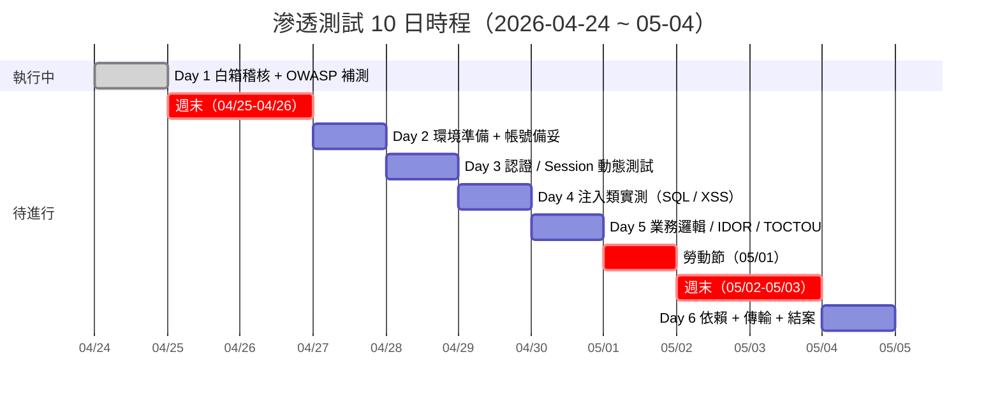
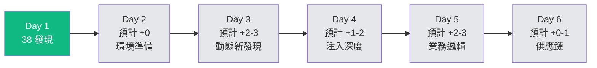

# 滲透測試每日進度報告

| | |
|---|---|
| **專案** | Volvo DMS 滲透測試 |
| **期間** | 2026-04-24 ~ 2026-05-04 |
| **報告對象** | 管理階層 / 專案追蹤 |
| **目前狀態** | 🟡 進行中（Day 1 / 6） |
| **本文件更新頻率** | 每工作日結束時 |

---

## 📊 整體進度快照

**工作日計算**：6 個工作日（跳週末 + 勞動節）
**進度**：**1 / 6 = 17% 完成**

---

## 進度儀表板

```mermaid
flowchart LR
    D1["✅ Day 1<br/>04-24 Fri"]
    W1["🚫 週末<br/>04-25/26"]
    D2["⏳ Day 2<br/>04-27 Mon"]
    D3["⏳ Day 3<br/>04-28 Tue"]
    D4["⏳ Day 4<br/>04-29 Wed"]
    D5["⏳ Day 5<br/>04-30 Thu"]
    H1["🚫 勞動節<br/>05-01"]
    W2["🚫 週末<br/>05-02/03"]
    D6["⏳ Day 6<br/>05-04 Mon"]

    D1 --> W1 --> D2 --> D3 --> D4 --> D5 --> H1 --> W2 --> D6

    style D1 fill:#10b981,color:#fff,stroke:#047857,stroke-width:2px
    style W1 fill:#d1d5db,color:#374151
    style D2 fill:#fef3c7,stroke:#f59e0b
    style D3 fill:#e5e7eb
    style D4 fill:#e5e7eb
    style D5 fill:#e5e7eb
    style H1 fill:#d1d5db,color:#374151
    style W2 fill:#d1d5db,color:#374151
    style D6 fill:#e5e7eb
```

---

# 📅 Day 1 — 2026-04-24（週五）✅ 已完成

## 今日主題
**白箱 code review + OWASP Top 10 全面覆蓋**

## 執行項目

### 1. 白箱程式碼審計（08:00 – 14:00）
- **檢查範圍**：
  - 後端：19 個 Express route (`/routes/*.js`)
  - 核心模組：`authMiddleware`、`auditLogger`、`bonusPeriodLock`、`parsers`、`utils` 等 7 個
  - 資料庫：`db/init.js`、`db/pool.js`
  - 前端：10 個 HTML 頁面（含 inline script）
  - 部署：`Dockerfile`、`package.json`

- **檢查工具**：
  - 手動 `grep` / `ripgrep` 搜尋危險模式
  - Code review（逐檔閱讀關鍵邏輯）
  - 依賴版本比對 CVE 資料庫

### 2. OWASP Top 10 (2021) 全面覆蓋（14:00 – 16:00）
| 類別 | 檢查重點 |
|------|---------|
| A01 Broken Access Control | `req.user.branch` 隔離、`:id` 路由權限檢查 |
| A02 Cryptographic Failures | pbkdf2 迭代、TLS、token 儲存 |
| A03 Injection | SQL / XSS / Formula / Command |
| A04 Insecure Design | 業務邏輯、race condition |
| A05 Security Misconfiguration | 預設密碼、CORS、安全標頭 |
| A06 Vulnerable Components | xlsx / multer / pg / express 版本 |
| A07 Authentication Failures | Rate limit、帳號鎖定、Session fixation |
| A08 Integrity Failures | Prototype pollution、反序列化 |
| A09 Logging Failures | Audit log 防竄改 |
| A10 SSRF | 使用者可控 URL 被 fetch |

### 3. 報告產出（16:00 – 18:00）
- 完整技術報告 `SECURITY_AUDIT_2026-04-24.md / .pdf`（24 頁）
- 向上簡報 `PENTEST_STATUS_BRIEF_2026-04-24.md / .pdf`（9 頁）
- 本進度文件

## 今日發現

| 嚴重度 | 數量 | 代表項目 |
|-------|------|---------|
| 🔴 CRITICAL | 5 | SQL Injection、Stored XSS、無 CSRF、xlsx CVE、Token localStorage |
| 🟠 HIGH | 9 | 無 rate limit、帳號鎖定、橫向越權、Bootstrap 密碼 log |
| 🟡 MEDIUM | 13 | Session 無閒置、pbkdf2 100k、錯誤洩漏、PG SSL |
| 🟢 LOW | 7 | Docker root、formula injection、小數截斷 |
| 🔵 INFO | 4 | timing attack、JSON body 過大 |
| ✅ **已驗證安全** | 4 | Mass Assignment、Session fixation、CORS、loopback SSRF |
| **總計** | **38** | |

## 今日產出

- 📄 `docs/SECURITY_AUDIT_2026-04-24.md`（38 KB，技術版）
- 📄 `docs/SECURITY_AUDIT_2026-04-24.pdf`（903 KB，24 頁）
- 📄 `docs/PENTEST_STATUS_BRIEF_2026-04-24.md`（11 KB，簡報版）
- 📄 `docs/PENTEST_STATUS_BRIEF_2026-04-24.pdf`（504 KB，9 頁）
- 📄 `docs/PENTEST_DAILY_LOG_2026-04-24.md`（本文件）

## 今日遇到的問題

| 問題 | 狀態 | 處置 |
|------|------|------|
| PG 服務一度卡住「啟動中」 | ✅ 解決 | 重啟 PG 服務後恢復 |
| 舊密碼使用 600k 迭代，新 code 用 100k → 登入失敗 | ✅ 解決 | verifyPassword 改相容 100k/600k |
| Zeabur DB 連線字串暫時失效 | ✅ 解決 | 環境變數重新設定 |
| DB root 密碼於對話中意外曝光 | ⚠️ **待處理** | **建議立即輪替** |

## 今日未完成 / 下次處理

- ✗ 尚未執行動態（black-box）測試
- ✗ 尚未對 staging 環境做 fuzzing
- ✗ 尚未實際觸發 POC 驗證白箱發現
- ✗ 尚未做供應鏈（supply chain）深度檢查

---

# 📅 Day 2 — 2026-04-27（週一）⏳ 計劃中

## 主題
**環境準備 + 測試帳號建立**

## 預計執行項目

### 1. Staging 環境建置（上午）
- 從 production 克隆一份獨立環境（資料匿名化）
- 確認可用同一套 code base + 獨立 DB
- 設定 proxy：Burp Suite / OWASP ZAP 攔截所有請求
- 錄製一組「正常使用」baseline（登入、查詢、上傳、匯出）

### 2. 測試帳號備妥（上午）
- `super_admin_test` × 1
- `branch_admin_AMA` / `branch_admin_AMC` / `branch_admin_AMD` × 3
- `user_AMA` / `user_AMC` / `user_AMD` × 3
- 額外：一個**被停用**帳號、一個**被鎖定**帳號（如有機制）

### 3. 攻擊工具準備（下午）
- `sqlmap`（SQL injection 自動化驗證）
- `Burp Suite Pro` 或 `ZAP`（intercept + repeater）
- `ffuf` / `wfuzz`（路徑 / 參數 fuzzing）
- `nuclei`（已知漏洞模板）
- 自製 payload 清單（XSS / SQLi / template injection）

### 4. 文件/計畫微調（下午）
- 依 Day 1 發現，調整後續測試優先順序
- 若管理階層已回覆 P0 修補時程，同步調整 scope

## 預期輸出
- ✅ Staging 環境可用
- ✅ 全 role 測試帳號就位
- ✅ 代理 / 工具設定文件
- ✅ Day 3 測試案例清單

## 依賴 / 需要協調
- 🔸 **IT 部門**：staging 環境建置權限
- 🔸 **DBA**：production 資料匿名化
- 🔸 **老闆**：staging 經費 / Zeabur 額外 service 費用

---

# 📅 Day 3 — 2026-04-28（週二）⏳ 計劃中

## 主題
**認證 / Session / Rate Limit 動態驗證**

## 測試項目

### 1. 登入暴力破解（對應 H2）
- **工具**：`hydra` 或自製 Python script
- **方法**：字典攻擊 + credential stuffing（RockYou 子集）
- **目標**：驗證 `/api/users/login` 確實無 rate limit
- **預期**：無限重試不被擋 → 確認漏洞存在

### 2. 帳號鎖定驗證（對應 H3）
- 故意連續輸錯密碼 10 次
- 觀察是否有鎖定機制 / 通知

### 3. Session 相關測試
- **Session fixation**（對應已驗證安全 ✅）：嘗試注入 pre-generated token
- **Session hijacking**：測試 token 是否 rotate
- **Idle timeout**（對應 M1）：登入後閒置 > 30 分、1h、4h、8h 測邊界
- **Logout 失效**：logout 後舊 token 應 403

### 4. Timing attack 帳號枚舉（對應 I4）
- **工具**：自製 timing measurement script
- **方法**：對存在帳號 vs 不存在帳號各打 100 次，觀察 response time 差異
- **預期**：存在帳號回應時間明顯較長 → 確認可枚舉

### 5. Token 漏洞驗證
- 讀 `localStorage.dms_token` → 確認 XSS 可竊取（C5）
- Token 權限變更後失效測試（H5）：改 role 後舊 token 是否仍有效

## 預期輸出
- ✅ H2 / H3 / H5 / I4 動態驗證結果
- ✅ Session 行為基線記錄
- ✅ Timing diff 統計圖

---

# 📅 Day 4 — 2026-04-29（週三）⏳ 計劃中

## 主題
**注入類漏洞實測（SQL / XSS / Formula）**

## 測試項目

### 1. SQL Injection 完整 POC（對應 C1）
- **工具**：`sqlmap` + 手動
- **目標端點**：`/api/audit-logs`
- **流程**：
  1. 使用 super_admin 測試帳號寫入 branch 欄位 payload
  2. 以 branch_admin token 觸發查詢
  3. 驗證可 `UNION SELECT` 拉出 `users.password_hash`
- **驗證安全**：確認 sqlmap 無法直接對 `/api/users/login` 注入（已用參數綁定）

### 2. Stored XSS 完整鏈（對應 C2 + C5）
- **工具**：Python `openpyxl` 產惡意 xlsx
- **流程**：
  1. 產生 Excel，`service_advisor` 欄位放 ``
  2. 上傳至 staging
  3. 切 super_admin 帳號看 stats 頁
  4. 觀察 attacker server 是否收到 token

### 3. Reflected XSS 掃描
- **工具**：`ZAP` 自動 XSS scanner + 手動
- **範圍**：所有 GET query params、POST body fields
- **重點**：錯誤訊息 innerHTML 路徑（H6）

### 4. Formula Injection 實測（對應 L3）
- 上傳 Excel 含 `=cmd|'/c calc'!A1`
- 下載該 Excel 版本 → 另一台機器開啟 → 觀察行為

### 5. Template / Prototype Pollution（對應 C4 + M10）
- 產生惡意 xlsx 觸發 `__proto__` 污染
- 驗證污染後行為變化

## 預期輸出
- ✅ C1 / C2 / C4 / L3 / M10 實際 POC 影片或截圖
- ✅ XSS 掃描結果報告
- ✅ 可復現的 payload 集合

---

# 📅 Day 5 — 2026-04-30（週四）⏳ 計劃中

## 主題
**業務邏輯 + 權限越權 + Race Condition**

## 測試項目

### 1. IDOR 橫向越權（對應 H8 + M9）
- 以 AMA branch_admin token 嘗試刪 AMC 廠資料：
  - `DELETE /api/bodyshop-bonus/applications/{AMC_ID}`
  - `PUT /api/bonus/actual-override`（改 AMC metric）
  - `DELETE /api/bonus/extra-bonuses/{AMC_ID}`
- 全站 `:id` 路由系統性測試
- 產生**越權矩陣表**：行=route，列=role，標記可/不可

### 2. 業務邏輯缺陷
- **負數金額**（M11）：POST extra-bonuses amount=-9999999
- **極大值**：amount=9999999999（overflow?）
- **非 JSON 型別**：amount=NaN / Infinity / null
- **期間鎖繞過**（M12）：併發送兩個 super-approve

### 3. Mass Assignment 邊界測試
- 雖然 code review 認定安全，動態驗證：
  - PUT `/api/users/{id}` body 帶 `role: super_admin`
  - 帶額外欄位 `password_hash`、`is_active`、`permissions`
  - 確認過濾機制真的擋得住

### 4. TOCTOU / Race Condition（對應 M12）
- **工具**：併發 HTTP client（Python `asyncio` + `aiohttp`）
- **場景**：
  - 2 個 super_admin 同時 approve + reject 同一筆
  - 觀察 DB 終態是否一致
- **期望**：找到不一致狀態 → 確認 race condition 存在

### 5. 權限提升（privilege escalation）完整圖
- 以最低權限 user 開始 → 逐項測試能否提升
- 產出**攻擊路徑圖**

## 預期輸出
- ✅ IDOR 越權矩陣
- ✅ 業務邏輯缺陷清單
- ✅ Race condition POC
- ✅ 攻擊路徑圖

---

# 📅 Day 6 — 2026-05-04（週一）⏳ 計劃中

## 主題
**依賴 / 傳輸層 / 結案**

## 測試項目

### 1. 依賴深度審計（對應 C4）
- **工具**：`npm audit`、`snyk`、`trivy`
- **範圍**：
  - Direct dependencies: 6 個
  - Transitive dependencies: 預估 200+ 個
- **重點**：xlsx 0.18.5 實際觸發 CVE-2023-30533 POC

### 2. 傳輸層 / 加密配置複查
- **工具**：`sslyze`、`testssl.sh`
- **測試項目**：
  - TLS 版本（應 ≥ 1.2）
  - Cipher suite 強度
  - 憑證鏈 + OCSP stapling
  - HSTS header 存在性
  - Cookie `Secure` / `HttpOnly` / `SameSite` flags
  - `X-Content-Type-Options` / `X-Frame-Options` / CSP

### 3. 供應鏈 / CI/CD 面
- `package-lock.json` 完整性（本次無，屬發現）
- Dockerfile 審計（layer 檢查、secret 檢查）
- Zeabur 環境變數洩漏面

### 4. 秘密掃描
- **工具**：`gitleaks`、`trufflehog`
- **範圍**：整個 git repo 歷史 + 當前 working tree
- **目標**：找出意外 commit 的 API key / password / token

### 5. 修補驗證（如 Phase 4 已開始）
- 對已修補項目重新跑原 POC → 確認失效
- 產出**修補前 vs 修補後對照表**

### 6. 結案報告 v2 + 簡報
- 合併 Day 1-5 所有動態測試結果
- 更新各 finding 的狀態（已驗證 / 已修補 / 未處理）
- 產出結案 executive summary（給老闆）
- 產出技術 handover（給開發團隊）

## 預期輸出
- ✅ 依賴 CVE 清單（含 transitive）
- ✅ 傳輸層配置報告
- ✅ 秘密洩漏掃描結果
- ✅ **最終結案報告**
- ✅ 修補前後對照（若 Phase 4 已執行）

---

## 📋 依賴項與風險追蹤

| # | 項目 | 類別 | 狀態 | 負責 |
|---|------|-----|------|------|
| 1 | PG root 密碼輪替 | 🔴 緊急 | ⚠️ 未處理 | IT |
| 2 | Staging 環境建置 | 🟠 依賴 | ⏳ Day 2 待執行 | IT |
| 3 | 資料匿名化 | 🟠 依賴 | ⏳ Day 2 待執行 | DBA |
| 4 | 管理階層對 P0 修補決策 | 🟠 依賴 | ⏳ 簡報後等回覆 | 老闆 |
| 5 | 勞動節休假 (5/1) | 🔵 時程 | 規劃中 | — |
| 6 | Day 4 的 XSS POC 需攻擊者 server | 🟡 技術 | ⏳ Day 2 準備 | 執行人員 |

---

## 📊 累計發現追蹤

**估計最終發現數**：40-47 項（約多 5-10 項動態獨有發現）

---

## 🎯 里程碑

| 日期 | 里程碑 | 狀態 |
|------|-------|------|
| 2026-04-24 | Day 1：白箱完成 | ✅ |
| 2026-04-24 | 向管理階層簡報 | ✅ |
| 2026-04-27 | Day 2：staging 就位 | ⏳ |
| 2026-04-29 | Day 4：C1/C2 POC 實證 | ⏳ |
| 2026-04-30 | Day 5：業務邏輯測試完成 | ⏳ |
| 2026-05-04 | Day 6：**專案結案 + 最終報告** | ⏳ |

---

## 🔄 更新紀錄

| 日期 | 更新內容 |
|------|---------|
| 2026-04-24 | 初版建立，Day 1 實績填入 |
| 2026-04-27 | （預留：Day 2 實績） |
| 2026-04-28 | （預留：Day 3 實績） |
| 2026-04-29 | （預留：Day 4 實績） |
| 2026-04-30 | （預留：Day 5 實績） |
| 2026-05-04 | （預留：Day 6 + 結案） |

---

## 📎 附註

- 本文件為**工作進度追蹤**用，每日下班前 15 分鐘更新
- 遇到阻礙（blocker）應標為 ⚠️ 並於當日回報管理階層
- 實際執行可能依資源 / 發現調整；若 scope 變動需明確記錄原因
- 每日新增發現會同步更新到 `SECURITY_AUDIT_2026-04-24.md`

**相關文件**：
- 技術報告：`docs/SECURITY_AUDIT_2026-04-24.pdf`
- 向上簡報：`docs/PENTEST_STATUS_BRIEF_2026-04-24.pdf`
- 本文件（每日進度）：`docs/PENTEST_DAILY_LOG_2026-04-24.md`
