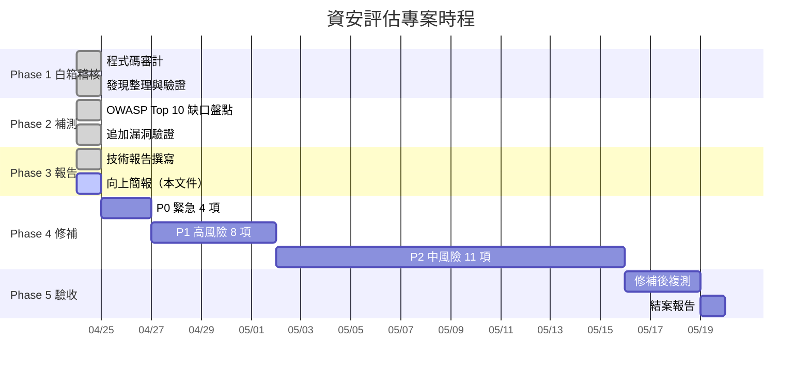
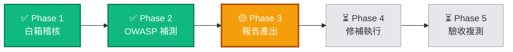
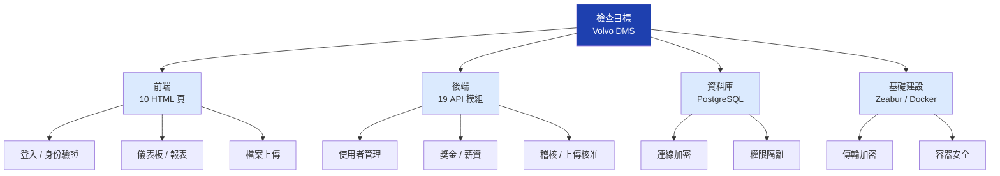
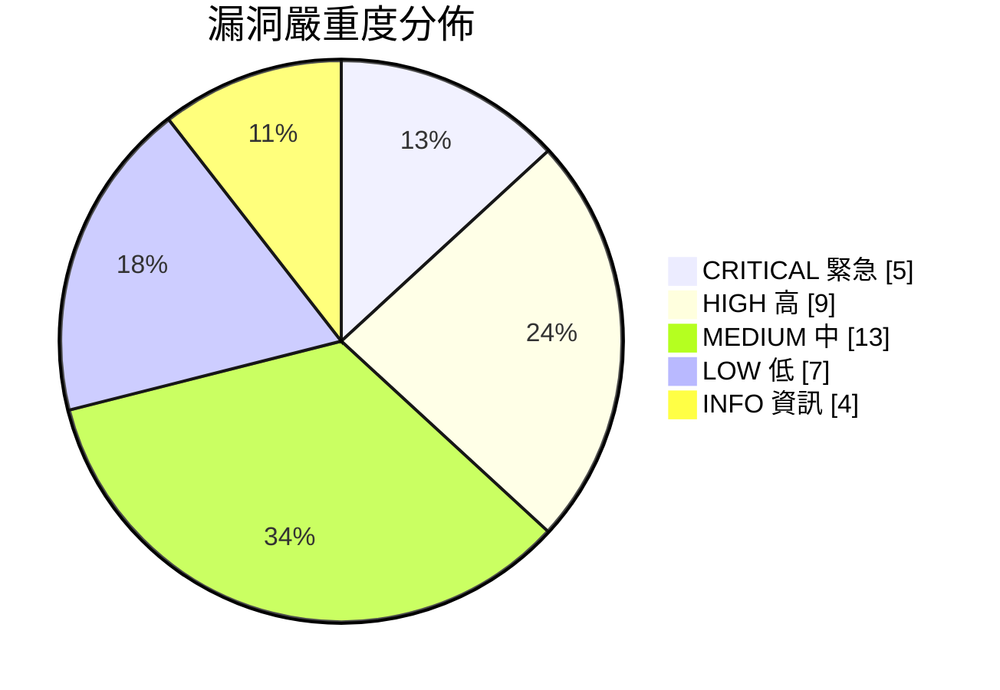
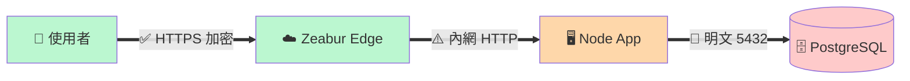
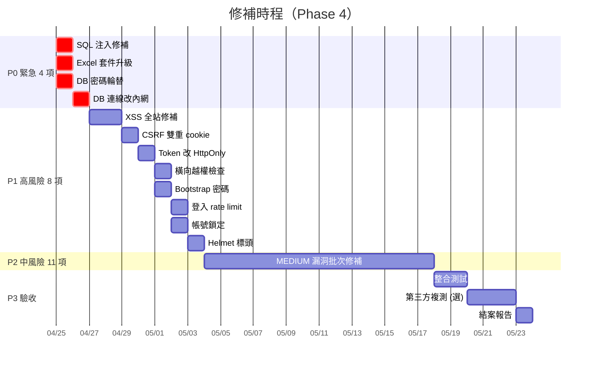
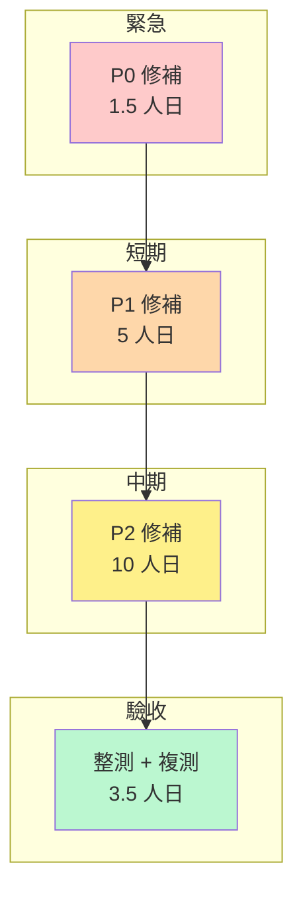
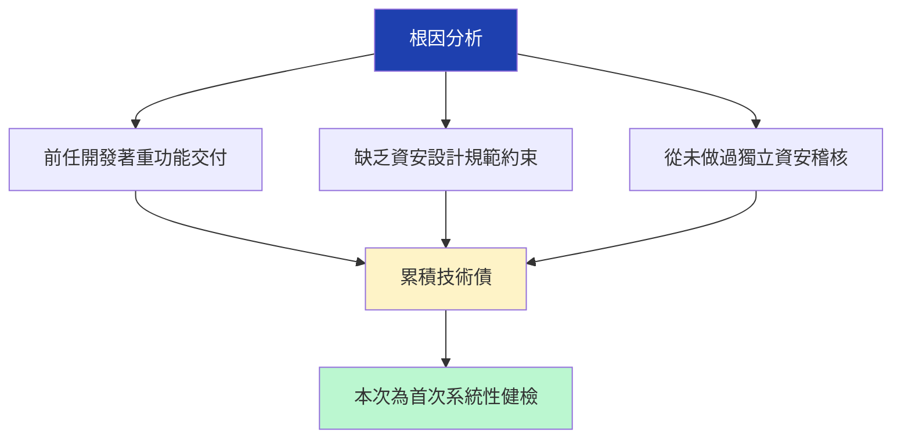
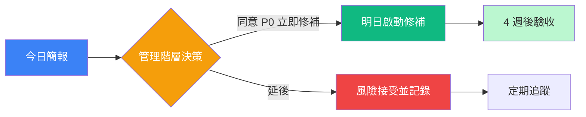

# 資安滲透測試 — 向上簡報

| | |
|---|---|
| **報告日期** | 2026-04-24 |
| **專案** | Volvo DMS 資安評估 |
| **報告對象** | 管理階層 |
| **版本** | v1.0 |
| **狀態** | 進行中（Phase 3 / 5） |

---

## 一句話摘要

> Volvo DMS 首次全面資安健檢完成，發現 **38 項**風險（5 項緊急），整體風險等級 **🔴 HIGH**，預估 **4 週 / 20 人日**可全面修補完畢。

---

## 🎯 專案進度（Gantt）

---

## 📊 當前階段狀態

**進度 60%**（3 of 5 phase 完成 / 進行中）

---

## 🔍 檢查範圍

**涵蓋面**：32 個原始碼檔 / 8 大類攻擊面 / OWASP Top 10 全 10 類

---

## 📈 發現總覽（KPI Dashboard）

| 指標 | 數值 | 說明 |
|------|------|------|
| 📁 檢查檔案數 | **32** | 涵蓋全部後端 + 主要前端 |
| 🔎 檢查面向 | **10** | OWASP Top 10 全覆蓋 |
| 🐞 發現漏洞總數 | **38** | 含已驗證安全項目 4 項 |
| 🔴 緊急 (CRITICAL) | **5** | 48 小時內 |
| 🟠 高風險 (HIGH) | **9** | 7 天內 |
| 🟡 中風險 (MEDIUM) | **13** | 30 天內 |
| 🟢 低風險 (LOW) | **7** | 季度計畫 |
| 🔵 資訊 (INFO) | **4** | 改善建議 |
| ⏱️ 預估修補工時 | **20 人日** | 單人 4 週 / 雙人 2 週 |
| 💰 第三方複測預算 | 另詢 | 建議修補後做一次 |

---

## 🎨 嚴重度分佈

---

## 🚨 關鍵風險（業務語言）

### 緊急級 — 5 項（可被直接利用）

#### 1️⃣ 客戶與員工資料可被整批竊取
> 若任一管理員帳號被釣魚或外洩，攻擊者可下一指令拖走全資料庫（包括所有人的密碼）。
- **業務衝擊**：個資法通報義務、商譽損失、客戶流失
- **修補難度**：低（30 分鐘 code 修改）

#### 2️⃣ 上傳功能可被用來接管老闆帳號
> 內部任何人有上傳權限者，可在 Excel 埋入惡意程式，老闆打開報表即被偷走 session。
- **業務衝擊**：內部人員可冒充高階主管操作
- **修補難度**：中（需全站補 HTML 過濾）

#### 3️⃣ Excel 解析套件含已知漏洞
> 系統使用的 xlsx 套件版本含 2 個已公告 CVE（2023、2024），可遠端污染系統行為。
- **業務衝擊**：有上傳權限者皆可觸發
- **修補難度**：極低（換個套件版本即可）

#### 4️⃣ 資料庫 root 密碼已於本次調查中外洩
> 評估過程對話中意外貼出完整連線字串+密碼，應視同洩漏立刻輪替。
- **業務衝擊**：公網可能直連 DB（外部 endpoint）
- **修補難度**：極低（5 分鐘）
- **狀態**：⚠️ **尚未輪替，建議 24h 內處理**

#### 5️⃣ 登入權杖存放位置不安全
> 權杖放在瀏覽器 localStorage，任何 XSS 攻擊即可竊取。
- **業務衝擊**：與 #2 形成攻擊鏈，放大傷害
- **修補難度**：中（改用 HttpOnly Cookie）

### 高級 — 9 項摘要
| # | 項目 | 一句話衝擊 |
|---|------|----------|
| H1 | 無瀏覽器安全標頭 | 可被 iframe 崁入做 clickjacking |
| H2 | 登入無頻率限制 | 攻擊者可無限試密碼 |
| H3 | 帳號無鎖定機制 | 弱密碼必被破解 |
| H4 | 檔案上傳無格式驗證 | 可偽造檔案類型 |
| H5 | 權限變更後舊 token 仍有效 | 降權後 8 小時內仍可操作 |
| H6 | 錯誤訊息洩漏 DB 結構 | 助攻擊者規劃攻擊 |
| H7 | Host header 可被操縱 | 內部 token 可能外送 |
| **H8** | **一位廠管可刪別廠資料** | **橫向越權，影響跨廠信任** |
| **H9** | **初始密碼印到雲端 log** | **雲端 log 可能保留數月~數年** |

---

## 🏗️ 系統架構安全狀態

**解讀**：外部到平台邊界安全；平台內部到 DB 屬**明文傳輸**，若走公網 endpoint 則網際網路可側錄。

---

## 📅 修補計劃（Roadmap）

---

## 📊 工時估計（分工視角）

**總計：約 20 人日 = 單人全職 4 週 / 兩人兼職 2 週**

---

## 💡 為什麼會發現這麼多漏洞

**同業比較**：一般內部系統首次資安稽核典型發現 20-50 項，本次 38 項屬**常態範圍**，**非品質異常**。

---

## 🤝 需要管理階層決策

| # | 決策項目 | 選項 | 建議 |
|---|---------|------|------|
| 1 | P0 修補是否立即停機處理？ | A. 立即停機 2 小時 / B. 週末非工時 | **A**，風險高不宜拖 |
| 2 | 人力投入模式 | A. 指派 1 人全職 4 週 / B. 2 人兼職 2 週 | **A**，context 集中 |
| 3 | 是否外聘第三方複測？ | A. 是 / B. 自行驗收 | **A**，客觀公信力 |
| 4 | 是否啟用 DB 自動備份？ | A. Zeabur 內建 / B. 獨立異地 | **B**，異地更安全 |
| 5 | 是否導入 CDN / WAF？ | A. Cloudflare 免費版 / B. 企業版 | **A** 起步 |
| 6 | 是否安排定期稽核？ | A. 每季 / B. 每年 / C. 不排 | **A** 或 **B** |

---

## 📋 結論與下一步

### 本週要做的事
- ✅ Phase 1-3 完成
- 🎯 **今日向管理階層報告** ← 此文件
- 📅 等決策後啟動 Phase 4

### 本週關鍵 action items

### 本文件限制
- 本份為**管理簡報**，**非技術操作手冊**
- 技術細節（攻擊手法、POC、修補 code）請見另一份完整報告：
  - 📄 `docs/SECURITY_AUDIT_2026-04-24.pdf`（24 頁技術報告）
  - 📝 `docs/SECURITY_AUDIT_2026-04-24.md`（Markdown 原始檔）

---

## 附錄 A：OWASP Top 10 覆蓋矩陣

| OWASP 類別 | 檢查 | 發現 | 最高嚴重度 |
|-----------|------|------|----------|
| A01 Broken Access Control | ✅ | 3 項 | 🟠 HIGH |
| A02 Cryptographic Failures | ✅ | 4 項 | 🔴 CRITICAL |
| A03 Injection | ✅ | 3 項 | 🔴 CRITICAL |
| A04 Insecure Design | ✅ | 2 項 | 🟡 MEDIUM |
| A05 Security Misconfiguration | ✅ | 5 項 | 🟠 HIGH |
| A06 Vulnerable Components | ✅ | 1 項 | 🔴 CRITICAL |
| A07 Authentication Failures | ✅ | 4 項 | 🟠 HIGH |
| A08 Software Integrity Failures | ✅ | 2 項 | 🟡 MEDIUM |
| A09 Logging Failures | ✅ | 2 項 | 🟡 MEDIUM |
| A10 SSRF | ✅ | 1 項 | 🟡 MEDIUM |

## 附錄 B：聯絡與後續

- **技術問題聯繫**：資安稽核執行人員
- **修補執行**：開發團隊（依 Phase 4 時程）
- **下次評估時間**：修補完成後 + 每季定期
- **風險清單 tracking**：建議建立 Jira / GitHub Issues 獨立看板

---

*本文件最後更新：2026-04-24*
